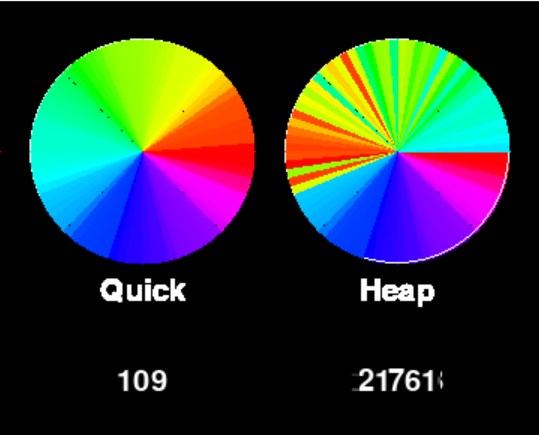
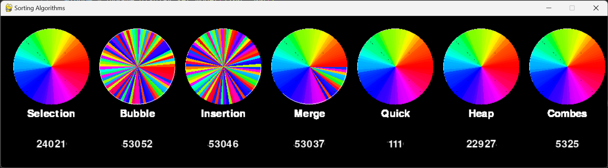

<!-- PROJECT SHIELDS -->
<!--
*** I'm using markdown "reference style" links for readability.
*** Reference links are enclosed in brackets [ ] instead of parentheses ( ).
*** See the bottom of this document for the declaration of the reference variables
*** for contributors-url, forks-url, etc. This is an optional, concise syntax you may use.
*** https://www.markdownguide.org/basic-syntax/#reference-style-links
-->

<!-- PROJECT LOGO -->
 

  

  <h3 align="center">Sort Algorithm</h3>

  

    This project is an application that visualizes the sorting of a color wheel using the several Sort algorithm. 
  

<!-- TABLE OF CONTENTS -->

  
Table of Contents

  <ol>
    <li>
      <a href="#about-the-project">About The Project</a>
      <ul>
        <li><a href="#built-with">Built With</a></li>
      </ul>
    </li>
    <li><a href="#contributor">Contributor</a></li>
    <li><a href="#contributing">Contributing</a></li>
  </ol>

<!-- ABOUT THE PROJECT -->
## About The Project

The "Papyrus of Heron" project is an exploration into the world of sorting algorithms, inspired by the legendary figure of Heron of Alexandria and his quest to organize the vast collection of knowledge in the Great Library of Alexandria during the 1st century AD.

We work on seven differents algorithm:

* Selection Sort
* Bubble Sort
* Insertion Sort 
* Merge Sort
* Quick Sort
* Heap Sort
* Comb Sort 

The graphical interface displays a color wheel where each color is represented by a value in an array, and the sorting is performed in real-time to show the sorting process.

(<a href="#readme-top">back to top</a>)

### Built With

* Python

(<a href="#readme-top">back to top</a>)

<!-- CONTACT -->
## Contributor

- **Barbara VANNI** (<a href="https://github.com/barbara-vanni">github</a>)

- **Walid SAAD EL KHALK** (<a href="https://github.com/walid-saadelkhalk">github</a>)

- **Anthony Yrles** (<a href="https://github.com/anthony-yrles">github</a>)

(<a href="#readme-top">back to top</a>)

<!-- CONTRIBUTING -->
#### Contributing

Contributions are what make the open source community such an amazing place to learn, inspire, and create. Any contributions you make are **greatly appreciated**.

If you have a suggestion that would make this better, please fork the repo and create a pull request. You can also simply open an issue with the tag "enhancement".
Don't forget to give the project a star! Thanks again!

1. Fork the Project
2. Create your Feature Branch (`git checkout -b feature/AmazingFeature`)
3. Commit your Changes (`git commit -m 'Add some AmazingFeature'`)
4. Push to the Branch (`git push origin feature/AmazingFeature`)
5. Open a Pull Request

(<a href="#readme-top">back to top</a>)

